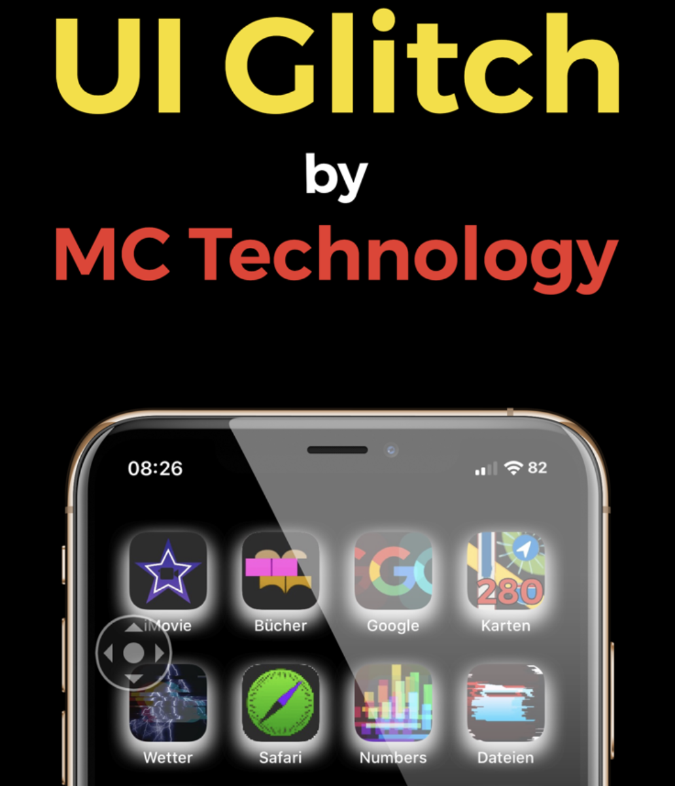
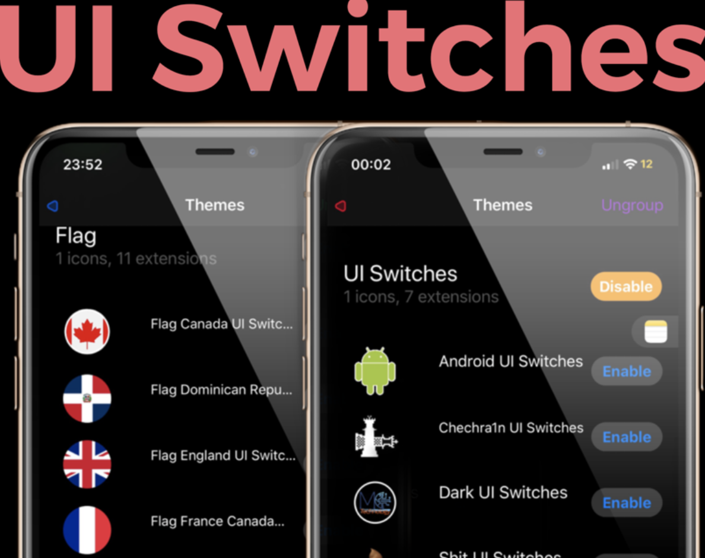

<h1 align="center">Hi there, I'm Marcos - MC Technology </h1>

<table align="right">
<tr>
<td>

[][youtube]
[][twitter]
[][instagram]
[][facebook]
[][reddit]

</td>
</tr>
</table>

  
:zap: About me!

### 🔬 Bioanalyst Clinico and I am currently studying a Master in Bioinformatic 💻!!
- 🦾 I love the PowerLifting!
- 🤓  I’m currently learning everything
- 👾  I am very curious and that is why you start studying programming
- 🗒  I am currently very obsected with learning vimscript

 

---

<h3 align="center"> Latest Projects</h3>

<tr>
<td>

[][gm]

</td>
<td> <h4 align="left"> <a href="https://github.com/mctechnology17/gm" target="_blank"><code>GitManager</code></a> </h4>
  

    
see more...

    GitManager(gm) git manager with a friendly user interface
    Compatibility: zsh/bash/fish/powershell and vim/vi/nvim/Gvim/MacVim

  
 </td>
</tr>
<tr>
<td>

</td>

<td> <h4 align="left"> <a href="https://github.com/mctechnology17/vim-better-header" target="_blank"><code>vim-better-header</code></a> </h4>
  

    
see more...

    vim-better-header is a better automated template

  
 </td>
</tr>
<tr>
<td>

[][vimtools]

</td>
<td> <h4 align="left"> <a href="https://github.com/mctechnology17/vimtools" target="_blank"><code>vimtools</code></a> </h4>
  

    
see more...

    VimTools is functions and settings
    that will make it easy for you life

  
 </td>
</tr>
<tr>
<td>

[][uiglitch]

</td>
<td> <h4 align="left"> <a href="https://repo.packix.com/package/com.mctechnology.uiglitch/" target="_blank"><code>UI Glitch</code></a> </h4>
  

    
see more...

    UI Glitch is here!!!
    Give your iPhone a different look with UI Glitch.
    The UI family by MC Technology! Designed for UI lovers!
    With UI Glitch you can get an exquisite combination to complement your themes!
    More than 20 Shades with different degrees of opacity and colors!
    Compatibility with thousands of themes!  Includes an exclusive animated theme!

  
 </td>
</tr>
<tr>
<td>

[][uiswitches]

</td>
<td> <h4 align="left"> <a href="https://repo.packix.com/package/com.mctechnology.uiswitches/" target="_blank"><code>UI Switches</code></a> </h4>
  

    
see more...

    UI Switches
    Give your iPhone a different look with UI Switches the UI family by MC Technology! Designed for UI lovers!
    How to use UI Switches?  Install Snowboard and Snowboard UI extension from Spark’s repo.
    Then activate the UI Switches from the Snowboard settings respring and enjoy :D !
    Or use iThemer or Anemone for activation

  
 </td>
</tr>

 
 

---

<h3 align="center"> Languages and Tools</h3>

    
    
    
    
    
    
    
    
    
    
    
    
    
    
    
    
    

---

<h3 align="left"> latest Videos</h3>

<!-- YOUTUBE:START -->
- [Depurando en VIM con vimspector | MC Technology](https://www.youtube.com/watch?v=wIU6Roqmljs)
- [Widgets en MacOS | MC Technology](https://www.youtube.com/watch?v=GLbsM1-rZno)
- [Como crear un perfil de GitHub como un pro &lpar;Readme&rpar; | MC Technology](https://www.youtube.com/watch?v=D5PjhcH36Vc)
- [Cómo instalar Windows 11 en VirtualBox | MC Technology](https://www.youtube.com/watch?v=J05qz-O4LLg)
- [Como usar Git con GitManager | MC Technology](https://www.youtube.com/watch?v=vs5CvLQFYhg)
<!-- YOUTUBE:END -->

➡️ [more videos...](https://www.youtube.com/channel/UC_mYh5PYPHBJ5YYUj8AIkcw)

---

<h3 align="left"> GitHub Stats</h3>

  <a href="https://github.com/mctechnology17">
  
  

[twitter]: https://twitter.com/mctechnology17
[youtube]: https://www.youtube.com/c/mctechnology17
[instagram]: https://www.instagram.com/mctechnology17/
[facebook]: https://m.facebook.com/mctechnology17/
[reddit]:https://www.reddit.com/user/mctechnology17

[vimtools]: https://github.com/mctechnology17/vimtools
[jailbreakrepo]: https://mctechnology17.github.io/
[uiglitch]: https://repo.packix.com/package/com.mctechnology.uiglitch/
[uiswitches]: https://repo.packix.com/package/com.mctechnology.uiswitches/
[gm]: https://github.com/mctechnology17/gm
[youtuberepo]: https://github.com/mctechnology17/youtube_repo_mc_technology
